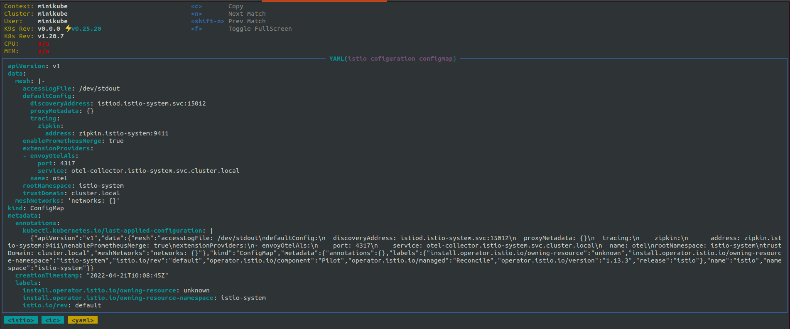
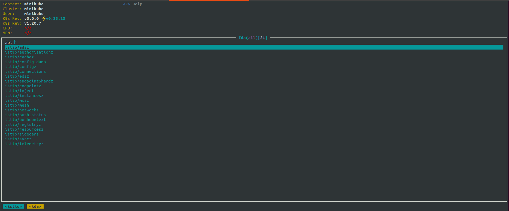
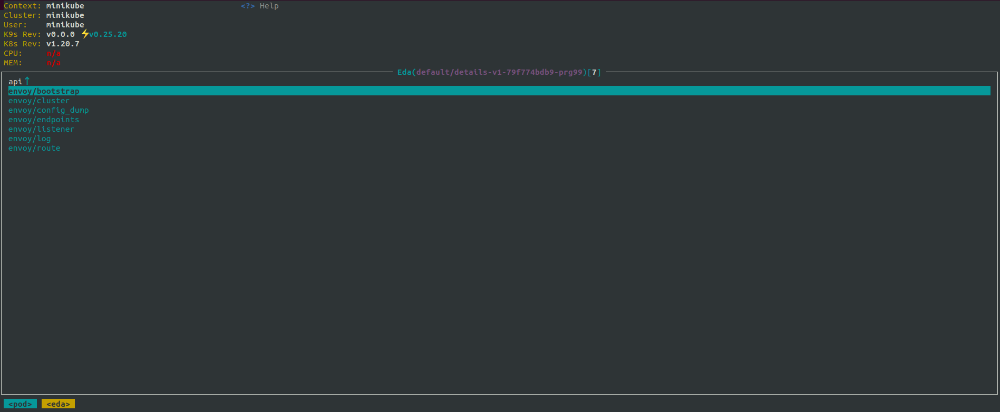

## 项目信息

目前`i9s`已经开源，项目开源地址: [i9s](https://github.com/slime-io/i9s) 。开发`i9s`的初衷是提高服务网格的运维效率，我们希望有一款工具可以便捷的查看`istio`和`envoy`的调试接口, 最好像`k9s`操作`pods`资源那样简单 。得益于`k9s`代码的可扩展性，我们基于[k9s-v0.25.18](https://github.com/derailed/k9s/releases/tag/v0.25.18)，提供了`istio` `envoy` 调试接口查看能力。

## 运维场景

在`istio`开发运维时，我们常常遇到服务治理规则不生效的问题，为了解决这个问题，可能会分以下几个步骤进行排查：

1. 查找服务`pods`, 这里以`view`服务为例
   ```
   kubectl -n skiff-demo-sidecar get pods
   demo-stock-viewer-sidecar-8547788687-lk48m       2/2     Running   0          15d
   ```

2. 执行`envoy config_dump`命令查看 `config_dump`文件
   ```
   kubectl -n skiff-demo-sidecar exec demo-stock-viewer-sidecar-8547788687-lk48m -- curl 127.0.0.1:15000/config_dump | less
   ```

3. 这时候,我们从config_dump文件中基本可以判断配置是否存在，是否错误。如果发现配置不存在，我们需要进一步排查控制面。

4. 目标转移到控制面，查找`istio pod`
   ```
   kubectl -n istio-system get pods
   istiod-112-5fb95d6fff-k94pz            1/1     Running     0          46h
   ```

5. 查看`istio`中是否有相关配置
   ```
   kubectl exec istiod-112-5fb95d6fff-k94pz -n istio-system -- curl 127.0.0.1:15014/debug/configz | less
   ```

6. 如果发现没有配置，可能是`istio`的上层问题（没下发）。如果是`istio`的问题，可以接着看下发到 view 服务的实际数据是否正常
   ```
   kubectl -n istio-system exec istiod-112-5fb95d6fff-k94pz -- curl 127.0.0.1:15014/debug/config_dump?proxyID=demo-stock-viewer-sidecar-8547788687-lk48m | less
   ```

7. 到这步基本就能判断出问题出在了控制面还是数据面

可以发现，在以上过程中我们需要反复利用`kubectl`查询相关信息，过程十分繁琐，为了简化以上过程，我们推出了`i9s`。

## i9s介绍

`i9s`的宗旨是提高`istio`的运维效率，从运维场景章节可以看到，配置下发生效问题的定位就需要多个`kubectl`交互命令，而`i9s`可以极大提升该过程的查询效率。目前`i9s`提供的功能包括

- `istio` 接口视图，包括`configz`,`adsz`,`config_dump` 等接口信息查看

- `enovy` 接口视图，包括`config_dump`,`cluster`,`endpoints` 等接口信息查看

- `revision`查看，从`revision`视角提供注入规则、deployment资源清单、`mesh`配置文件等信息

## 运行

前提须知：需要指定`kubeconfig`, 且目前以适配istio 1.12 为主,由于不同版本接口不同，可能导致查询其他版本的接口时出现问题。

- 镜像方式(需要将kubeconfig文件挂载进容器内)
```
docker run -it --net=host -v $HOME/.kube/config:/root/.kube/config slimeio/i9s:v0.0.1
```

- 二进制方式, 该安装脚本（在开源项目中）会检查本地是否有`kubectl`, 如果没有需用户自行安装。之后会检查jq,less等命令是否存在，如果不存在会自动安装, 之后会运行镜像，并将镜像中的 i9s,istioctl 可执行文件移动至 /usr/bin 目录下
```
sh ./install.sh
i9s
```

由于有些`minikube` 权限问题，可能需要将`kubeconifg`中`client-key`的目录一同挂进容器

## 使用说明

- 按下 `:istio` 切换至`isito revision`视图，可以选在不同`rev`


- 选中`rev`按下 `enter` 进入`rev`详情页面, 包含注入规则、`deployment`清单和`mesh configuration`


- 选中`istiod configuratiojn`按下 `enter` 展示了`mesh` 配置项详情



- 在`istio revision` 视图下，选中`rev`并按下`m`(mesh)进入`isito api`视图， 展示可调试的`istio`接口列表



- 选中`istio/configz`按下 `enter`展示`debug/configz`信息, 支持`less`操作，按`q`退出


- 选中服务（接入网格的服务）所在`pod`并按下`m`(mesh) 进入`envoy api`视图，展示可调试的`envoy`接口信息



- 选中`envoy/config_dump`进入`/config_dump` 接口，支持`less`操作，按`q`退出


## Release && 视频教程

版本 [release](https://github.com/slime-io/i9s/releases)

`i9s`介绍和使用说明 [视频](https://www.bilibili.com/video/BV1JZ4y1Y71i?pop_share=1&vd_source=00e91b5259369c7e4fedda13d49048d8)

## 展望

`i9s` 目前提供了`istio`和`envoy`接口查看能力, 结合`k9s` 已有的能力，我们可以极大提升日常的`istio` 的维护效率。 由于项目目前处于起步阶段，功能尚不全面，在接下来的一段时间内，我们将提升用户的使用体验并为`i9s`提 供更多的分析能力，努力将`k9s`和`istioctl`更好的结合，提升运维效率。