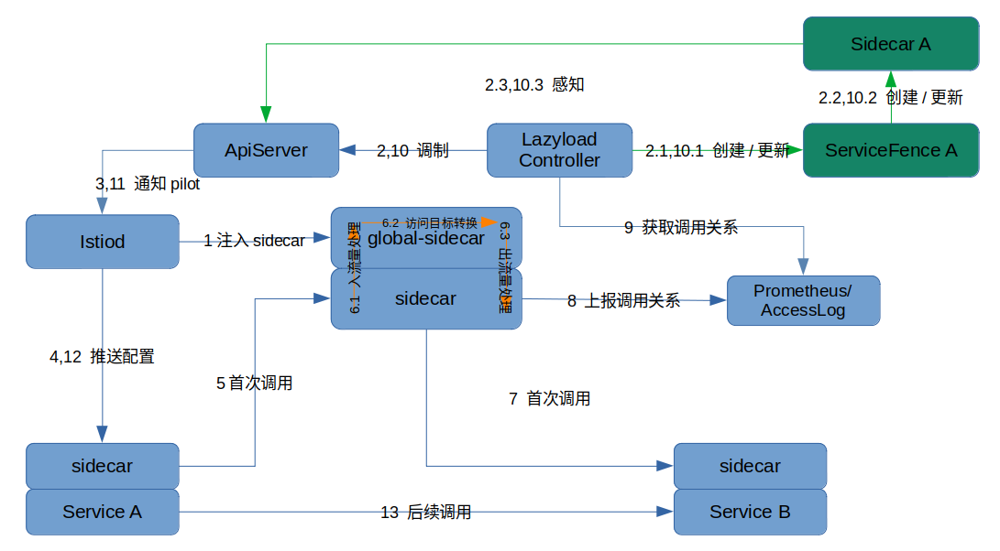

整个模块由 `lazyload controller` 和 `global-sidecar` 两部分组成。`lazyload controller` 无需注入 sidecar ，global-sidecar 则需要注入。

注：绿色箭头为lazyload controller内部逻辑，黄色箭头为global-sidecar内部逻辑。

过程说明：

1. 部署Lazyload模块，自动创建global-sidecar应用，Istiod会为global-sidecar应用注入标准sidecar（envoy）

2. 为服务A启用懒加载：

    2.1 创建ServiceFence A

    2.2 创建Sidecar（Istio CRD）A，根据静态配置（ServiceFence.spec）初始化

    2.3 ApiServer感知到Sidecar A创建

3. Istiod从ApiServer获取Sidecar A的内容

4. Istiod下发Sidecar A限定范围内的配置给Service A的sidecar

5. Service A发起访问Service B，由于Service A没有Service B的配置信息，请求发到global-sidecar的sidecar

6. global-sidecar处理

    6.1 入流量拦截，如果是accesslog模式，sidecar会生成包含服务调用关系的accesslog

    6.2 global-sidecar根据请求头等信息，转换访问目标为Service B （转发）

    6.3 出流量拦截，因为sidecar拥有所有服务配置信息，所以可以找到Service B目标信息，正确的发出请求

7. 请求正确到达Service B

8. global-sidecar通过accesslog方式上报调用关系Service A->Service B，如果是prometheus模式，则由应用方的sidecar生成、上报metric

9. lazyload controller获取到调用关系

10. lazyload更新懒加载配置

     10.1 更新ServiceFence A，添加关于A访问B的metric

     10.2 更新Sidecar A： egress.hosts添加服务B的信息

     10.3 ApiServer 感知到Sidecar A更新

11. Istiod从ApiServer获取Sidecar A新内容

12. Istiod下发Sidecar A限定范围内的配置给Service A的sidecar，新增了B的xDS内容

13. 后续调用，Service A直接访问Service B成功

------

NOTE: 根据服务依赖关系指标来源的不同，分为两种模式：

- Accesslog 模式：`global-sidecar` 通生成包含服务依赖关系的 `accesslog` 作为指标
- Prometheus 模式：业务应用在完成访问后，生成 promtheus metric ，作为指标

推荐 Accesslog 模式。具体的细节说明可以参见[教程](./tutorial.md##基于accesslog开启懒加载)
