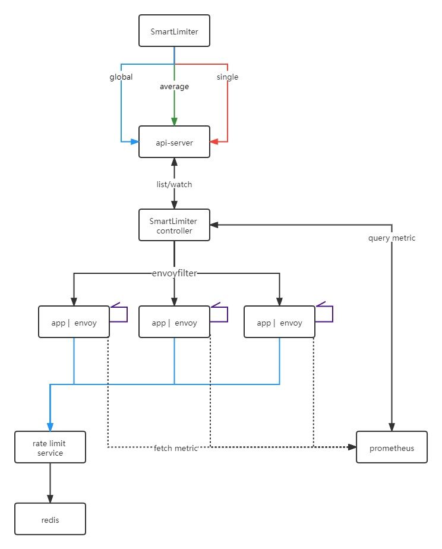

服务限流的目的是为了保护服务不被大量请求击垮，通过限制请求速率保护服务正常运行，在服务网格体系中，需要下发复杂的的EnvoyFilter才能完成限流。为了减轻用户使用难度，我们们推出了限流组件slime/limiter，用户只需提交贴近用户语义的SmartLimiter资源，即可完成限流规则的下发。

## 思路
slime/limiter 组件监听smartlimiter资源，自动生成包含限流规则的envoyfilter。

- 对于网格场景，envoyfilter会下发给作为sidecar的envoy,在envoy的入口进行限流判断。
- 对于网关场景，envoyfilter被下发给作为router的envoy，在envoy的出口进行限流判断。

## 使用

`SmartLimiter`的CRD定义的比较接近自然语义, 例如，以下样例中，对review服务的9080端口设置限流规则 10次/s

~~~yaml
apiVersion: microservice.slime.io/v1alpha2
kind: SmartLimiter
metadata:
  name: review
  namespace: default
spec:
  sets:
    v1:
      descriptor:
      - action:
          fill_interval:
            seconds: 1
          quota: "10"
          strategy: "single"
        condition: "true"
        target:
          port: 9080
~~~

## 架构
自适应限流的主体架构分为两个部分，一部分包括`SmartLimiter`到`EnvoyFilter`的逻辑转化，另一部分包括集群内监控数据的获取，包括服务的`CPU`, `Memory`,`POD`数量等数据。

